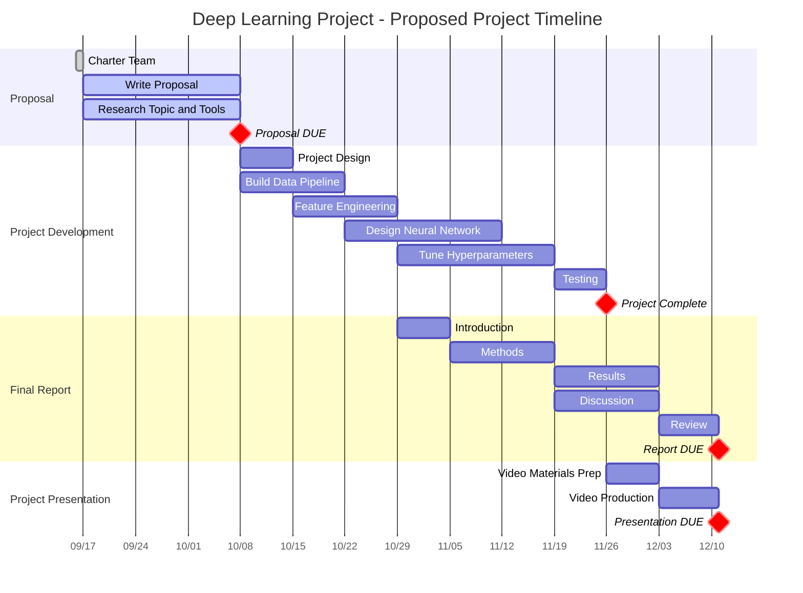

# dlProject
Project for Deep Learning Course

## Schedule

Planned as of Proposal. 

## Package Management

[Poetry](https://python-poetry.org/) is setup and optional to use, but nice if you choose to. 
