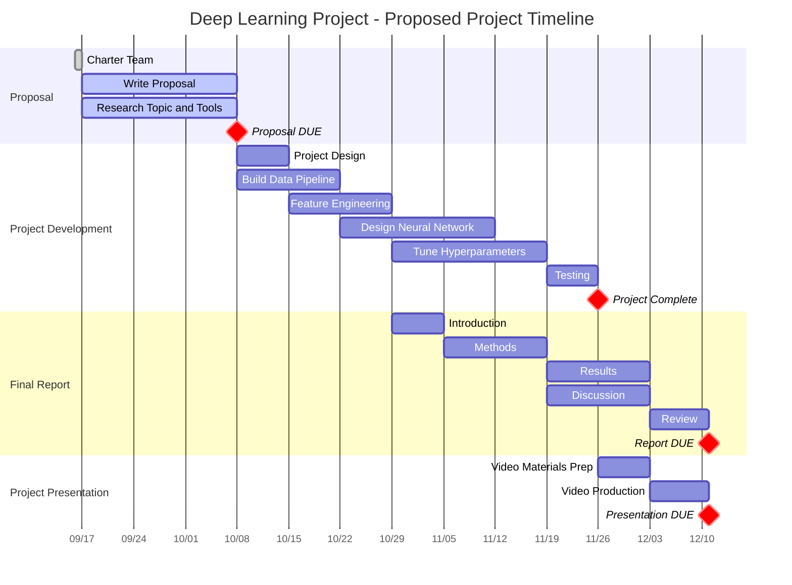

# Introduction:

The food industry plays a critical role in ensuring public health and safety. Quality control in the food sector is vital to guarantee that products meet the necessary standards for consumption. With advancements in deep learning techniques, there is an opportunity to create an automated and efficient system for identifying fruits and assessing their condition before distribution. This system not only identifies fruits but also evaluates their condition, preventing the spoilage of entire lots due to a few bad fruits. By minimizing wastage, this technology stands to significantly impact food sustainability and resource utilization.

# Proposal: 

We present a comprehensive project to create an automated Fruit Quality Control System using a meticulously curated [dataset](https://data.mendeley.com/datasets/6ps7gtp2wg/1) of 16,000 labeled images, each containing 2,000 images of 8 diverse fruits, equally balanced between fresh and spoiled conditions. This rich dataset forms the foundation of our research, enabling rigorous training and validation.
Our primary focus is the implementation of state-of-the-art Convolutional Neural Network (CNN) architectures. In addition, we aim to explore the efficiency and accuracy of EfficientNet architectures, specifically tailored for low-computing environments. This dual approach ensures a thorough evaluation of models in varying computational scenarios.

# Responsibilities:

The roles and responsibilities will be shared across the team, but here are some key tasks and the associated stakeholders.

| Task                         | Mark | Rahul | Sahil |
|------------------------------|------|-------|-------|
| Data Pipeline                |   X  |       |       |
| Data Preprocessing           |   X  |       |   X   |
| CNN Architecture(s)          |   X  |   X   |   X   |
| Hyperparameter Tuning        |   X  |   X   |   X   |
| Model Deployment on Cloud    |   X  |       |   X   |
| Presentation Production      |      |       |   X   |
| Report Production            |   X  |       |       |

# Technical Approach and Goals:

- Employ industry-standard CNN architectures such as VGG16, ResNet, EfficientNet, and Inception, and compare their accuracies to identify the most suitable model. We will tone down the layers depending upon computing capacity, if required. 
- Significant reduction in training time through the application of transfer learning, optimizing the model for our specific dataset.
- Enhanced model performance achieved through systematic hyperparameter tuning, resulting in accurate and efficient fruit recognition.
- Accurate object detection and probability labeling, providing detailed insights into the model's confidence levels and enabling precise quality assessment.
- Successful implementation of EfficientNet and deploying the solution on low-computation architectures (e.g. Raspberry Pi), demonstrating the system's adaptability to diverse computing environments.

## Projected Timeline

