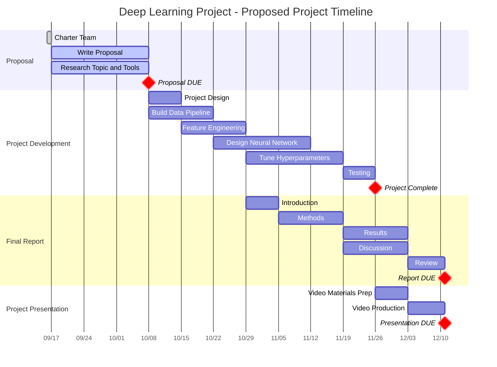

# Option 1

## Introduction

Phish^[https://en.wikipedia.org/wiki/Phish] is an immensely popular jam band from Vermont who have been playing together since 1984. Jam bands are a type of rock and roll band that focus on an improvisational play style, similar to Jazz, such that the musicians do not pre-plan the songs they will play during a show. In this way, the songs played at a given show are pseudo-randomly chosen. *Pseudo-random* because sometimes there are constraints which might influence the playing of a song, such as temporal frequency (not playing the same song on two back-to-back shows) or positional sequencing (songs which are often played in sequence with one another). 

Utilizing a public API^[https://docs.phish.net/] of historical song and setlist data, previous works have investigated the network relationships^[https://github.com/greenmmq/PhishSongNetwork] between songs from their past co-appearances, and applied a recurrent neural network architecture with word2vec embeddings to predict the next song in a sequence^[https://towardsdatascience.com/predicting-what-song-phish-will-play-next-with-deep-learning-947ccce3824d] with up to 21.8% validation accuracy. 

## Proposal

As of 2022, music streaming is an \~18 Billion dollar industry^[https://www.weforum.org/agenda/2023/03/charted-the-impact-of-streaming-on-the-music-industry/]. Music recommendation is a key differentiator for streaming platforms and neural networks play a central role in accomplishing this task. Traditional music recommendation systems often include user data as input variables to the recommendation model or may recommend songs from multiple similar, but different, bands or genres; however, this approach may not be effective for "dedicated fans" - a subset of users whose listening habits tend to be more focused around an individual band and their compositional tendencies. 

This project proposes to construct a neural network model to learn the compositional tendencies of an artist from historical song and setlist data to predict future setlists and song appearances. In doing so, this neural network will provide a novel mechanism by which songs can be better recommended to music streaming users with musical tastes dedicated to a particular artist or band.

## Responsibilities

The roles and responsibilities will be shared across the team, but here are some key tasks and the associated stakeholders. 

Task | Rahul | Sahil | Mark
-----|-------|-------|-----
Data Pipeline | | | X
Feature Engineering | | X |
Neural Network Architecture | X | | 
Hyperparameter Tuning | X | X | X 
Presentation Production | X | X | X
Report Production | | | X

## Technical Approach and Goals

The approach will use the `Keras` API for `Tensorflow`. Here are some goals:

1. **Option 1**: Recreate the experiments performed by similar previous deep learning explorations^[https://github.com/andrewrreed/phish-setlist-modeling/tree/master] on these data.
2. **Option 2**: Improve upon these methods with different problem statement, feature engineering layers, neural network architectures, and hyperparameter tunings to improve prediction performance. 
3. **Option 3**: Leverage the implicit graph structure of the relationships between songs and setlists over time to implement a graph neural network^[https://proceedings.neurips.cc/paper/2020/file/ba95d78a7c942571185308775a97a3a0-Paper.pdf] to improve prediction performance. 

# Option 2

## Introduction:

The food industry plays a critical role in ensuring public health and safety. Quality control in the food sector is vital to guarantee that products meet the necessary standards for consumption. With advancements in deep learning techniques, there is an opportunity to create an automated and efficient system for identifying fruits and assessing their condition before distribution. This system not only identifies fruits but also evaluates their condition, preventing the spoilage of entire lots due to a few bad fruits. By minimizing wastage, this technology stands to significantly impact food sustainability and resource utilization.

## Proposal: 

We present a comprehensive project to create an automated Fruit Quality Control System using a meticulously curated dataset^[https://data.mendeley.com/datasets/6ps7gtp2wg/1] of 16,000 labeled images, each containing 2,000 images of 8 diverse fruits, equally balanced between fresh and spoiled conditions. This rich dataset forms the foundation of our research, enabling rigorous training and validation.
Our primary focus is the implementation of state-of-the-art Convolutional Neural Network (CNN) architectures. In addition, we aim to explore the efficiency and accuracy of EfficientNet architectures, specifically tailored for low-computing environments. This dual approach ensures a thorough evaluation of models in varying computational scenarios.

## Responsibilities:

The roles and responsibilities will be shared across the team, but here are some key tasks and the associated stakeholders.

| Task                         | Mark | Rahul | Sahil |
|------------------------------|------|-------|-------|
| Data Pipeline                |   X  |       |       |
| Data Preprocessing           |   X  |       |   X   |
| CNN Architecture(s)          |   X  |   X   |   X   |
| Hyperparameter Tuning        |   X  |   X   |   X   |
| Model Deployment on Cloud    |   X  |       |   X   |
| Presentation Production      |      |       |   X   |
| Report Production            |   X  |       |       |

## Technical Approach and Goals:

- Employ industry-standard CNN architectures such as VGG16, ResNet, EfficientNet, and Inception, and compare their accuracies to identify the most suitable model. We will tone down the layers depending upon computing capacity, if required. 
- Significant reduction in training time through the application of transfer learning, optimizing the model for our specific dataset.
- Enhanced model performance achieved through systematic hyperparameter tuning, resulting in accurate and efficient fruit recognition.
- Accurate object detection and probability labeling, providing detailed insights into the model's confidence levels and enabling precise quality assessment.
- Successful implementation of EfficientNet and deploying the solution on low-computation architectures (e.g. Raspberry Pi), demonstrating the system's adaptability to diverse computing environments.

# Projected Timeline

